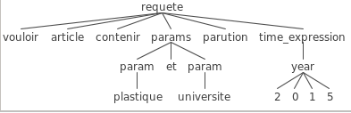

# Setup
See `environment.yml` for dependencies.

Generate `antlr4` classes from our grammar:
```bash
antlr4 -o gen -listener -visitor -Dlanguage=Python3 GrammaireSQL.g4
```

# Description des objectifs
Gérer des requêtes portant sur les articles, éventuellement avec des contraintes de contenu et ou de temporalité.

Exemples de phrases que nous souhaitons être capables de gérer:
* Affiche-moi les articles qui contiennent des actualités.
* Afficher les articles plus vieux que 2013.
* Articles parlant d'innovation.
* Donner les articles parus en 2011.
* Donnez moi les articles sur le diabète

Ce que nous décidons de ne pas gérer:
* Toutes les aggrégations sur les auteurs des articles.
* Toutes les aggrégations sur les rubriques des articles.
* Les requêtes dont la structure (l'ordre des éléments) change complètement de celle que nous avons pour base (la première requête des exemples précedents).


# Documentation
Tables de la base de données
http://www4.utc.fr/~lo17/faq.html#faq10

## Architecture
Architecture overview:


On a donc deux lexiques différents: un pour la structure des requêtes et un pour les paramètres de la partie WHERE de la requête SQL finale.

## Pre-parser
Statégie du pre-parser:


Détails sur l'algorithme du pre-parser, l'`Organisateur`:
* Dans "Je `veux` article contenir `afficheur`", `veux` sera interprété comme un mot de la structure signifiant `vouloir`, tandis que `afficheur` venant après l'action de `vouloir` sera interprété comme un paramètre.
* TODO

## Grammaire Antlr
### Exemple d'arbre
vouloir article contenir plastique et universite parution 2015




# Exemples de requête qui fonctionnent:
```sql
-- Je veux les articles qui parlent de Casablanca.
SELECT DISTINCT * FROM titre WHERE titre.mot LIKE '%casablanca%'
-- Affiche les article qui contiennent Paris
SELECT DISTINCT * FROM titre WHERE titre.mot LIKE '%paris%'
-- Combien d'articles sont parus en 2013 et contiennent cancer ?
SELECT COUNT(*) FROM titre  LEFT JOIN date ON titre.fichier = date.fichier WHERE date.annee = '2013' AND titre.mot LIKE '%cancer%'
```

